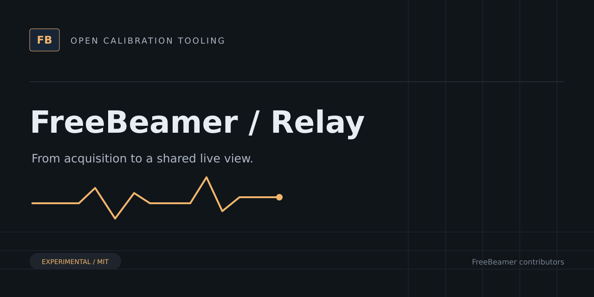

# FreeBeamer Relay



Self-hosted Go telemetry relay with authenticated ingestion, SQLite storage, session history, and WebSocket live feeds.

> [!WARNING]
> Experimental software. Not validated for vehicle use. Do not flash files produced by FreeBeamer.

Receives telemetry from CLI/mobile clients and serves live data to desktop consumers. Supports client keys, session/capability negotiation, replay, and SQLite persistence.

See [deployment instructions](deploy/README.md). The `relay` Go package is exported so companion applications can run integration tests against the real server; its API is experimental.

## Development

```sh
go test ./...
go build -o bin/freebeamer-relay ./cmd/freebeamer-relay
```

## Related projects

- [Core](https://github.com/freebeamer/core) — Go libraries for ECU calibration formats, binary editing, checksums, vehicle profiles, and telemetry contracts.
- [CLI](https://github.com/freebeamer/cli) — Command-line tools for inspecting calibration files, reviewing binary changes, verifying checksums, and collecting experimental live data.
- [Desktop](https://github.com/freebeamer/desktop) — Experimental ECU calibration editor and live-data viewer built with Go, Wails, Angular, and Plotly.
- [Mobile](https://github.com/freebeamer/mobile) — Experimental Flutter companion for read-only MHD/ENET live-data acquisition and upload to a FreeBeamer telemetry relay.

## Contributing and license

See [CONTRIBUTING.md](CONTRIBUTING.md). Source and original artwork are licensed under [MIT](LICENSE). Do not submit proprietary firmware, customer files, secrets, or identifying vehicle data.
